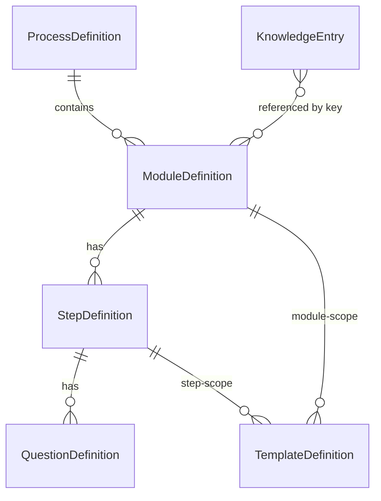

# Architekturdokument

**Produkt:** Modulare KI-gestützte Onboarding-Plattform für Datenschutzprozesse (Zweiplus)
**Status:** MVP-Architektur, Grundlage für [Implementierungsplan](implementierungsplan.md)

---

## 1. Zweck & Scope

Eine webbasierte Plattform, die Datenschutz-Onboardings als **konfigurierbare Module** abbildet. Kunden bearbeiten freigeschaltete Module (Steps + Fragen), erhalten **kontextbezogene KI-Hilfe** auf Basis modulbezogener Wissenskonfiguration, Eingaben werden **im Backend verbindlich validiert**, Zweiplus prüft/gibt frei, und validierte Daten werden in ein **kanonisches Zwischenmodell** überführt und über **Zielsystem-Adapter (DPMS)** gemappt.

Scope-Grenzen siehe [annahmen.md](annahmen.md) und Anforderungsdokument §7.2.

## 2. Architekturprinzipien (aus Anforderungen §18)

1. **Module statt Einzelformulare** — alles ist Definition-driven, nichts ist im Frontend hartcodiert.
2. **Definition vs. Instance** — `*Definition` = Konfiguration (geseedet), `*Instance` = konkrete Kundenbearbeitung mit Zustand.
3. **KI assistiert, Backend validiert verbindlich** — KI liefert strukturierte Vorschläge & semantische Prüfung; deterministische Wahrheit kommt aus dem Backend.
4. **Seams für austauschbare Externe** — KI-Provider, Datei-Storage, Zielsystem-Adapter hinter Interfaces; per Konfiguration wählbar; Fake-Implementierungen für Tests.
5. **Kanonisches Zwischenmodell vor Zielsystem** — Zielsysteme (DPMS) nur über Adapter, nie in der Modullogik.
6. **Nachvollziehbarkeit** — jede Antwort trägt Herkunft (`user|ai|document|manual`) und Audit-Felder.

## 3. Systemkontext

```mermaid
flowchart TD
  U[Kunde / Zweiplus-Reviewer] --> FE[Web-Frontend\nReact + Vite + TS]
  FE -->|REST /api| BE[Backend / Modul-Engine\nFastAPI]
  BE --> DB[(PostgreSQL)]
  BE --> ST[/Datei-Storage\nlocal, Seam/]
  BE -->|AiProvider Seam| AI{{KI-Provider\nfake | Anthropic Claude}}
  BE -->|TargetAdapter Seam| DPMS{{DPMS-Adapter\nMapping + Importvorschau}}
```

## 4. Komponenten / Module

### 4.1 Frontend (`frontend/`)
React + Vite + TypeScript. Rendert Module **dynamisch** aus den vom Backend gelieferten Definitionen. Design ausschließlich über `src/styles/tokens.css` (Kopie aus `docs/design-system/`).

- **Dashboard** — Modulübersicht (Karten: Status, Fortschritt, Zuständigkeit, gesperrt/frei, nächste Aktion), Gesamtfortschritt, Dashboard-KI-Chat.
- **Modul-Start** — Intro (Ziel/Warum/Wer/Aufwand/Explainer), Vorlagen, Start/Fortsetzen.
- **Modul-Bearbeitung** — Step-Navigation (abgehakt), Progressbalken, dynamische Fragefelder (4 Antworttypen), Upload, KI-Hilfe je Frage, Vorlagen, Validierungshinweise.
- **Review (Zweiplus)** — Antworten, KI-Vorschläge, KI-/Backend-Validierungen, Editieren, Freigabe/Rückgabe, Importvorschau.
- **API-Client** — generiert/handgepflegt gegen [openapi.yaml](openapi.yaml); Auth via Bearer-Token.

### 4.2 Backend (`backend/`) — FastAPI
Schichten:
- **API-Layer** (`app/api/`) — Router pro Domäne, Pydantic-Schemas (Request/Response), Auth-Dependency.
- **Service-Layer** (`app/services/`) — Modul-Engine (Freischaltung, Progress, Status-Statemachine), Validierungs-Service, KI-Orchestrierung, Review, Canonical/Import.
- **Seams** (`app/providers/`) — `AiProvider`, `FileStorage`, `TargetAdapter` als ABCs + Konkretionen + Fakes; Auswahl per Settings.
- **Persistenz** (`app/models/`, `app/db/`) — SQLAlchemy-Modelle, Alembic-Migrationen, Repositories.
- **Seeds** (`seeds/`) — Prozess-/Modul-/Step-/Frage-/Template-/Knowledge-Definitionen als JSON; Loader idempotent beim Start.

## 5. Datenmodell

### 5.1 Definitionen (Konfiguration, geseedet)



- **ProcessDefinition**: `id, key, name, description`
- **ModuleDefinition**: `id, key, process_def_id, name, short_description, intro(json: goal/why/who/effort/explainer), responsible_role, estimated_effort, order_index, unlock_rule(json), ai_knowledge_config(json), output_schema_key, target_mappings(json[]), enabled`
- **StepDefinition**: `id, key, module_def_id, title, description, order_index, ai_knowledge_config(json)`
- **QuestionDefinition**: `id, key, step_def_id, label, description, type(enum), required, options(json[]), help_text, ai_help_enabled, validation_rules(json), knowledge_scope(json[]), visibility_rule(json|null), order_index`
- **TemplateDefinition**: `id, key, scope(module|step), owner_key, type(email|file|text), title, subject, body, file_name, file_type`
- **KnowledgeEntry**: `id, key, title, category, content`

`unlock_rule` Formen: `{"type":"always"}` · `{"type":"after","requires":["moduleKey",…]}` · `{"type":"manual"}`. Parallele Freischaltung = zwei Module mit `after` auf dieselbe Voraussetzung.

`visibility_rule` Form: `{"questionKey":"…","equals":"…"}` oder `null` (immer sichtbar).

### 5.2 Instanzen (Laufzeitzustand)

- **ProcessInstance**: `id, process_def_id, customer_name, customer_org, status, created_at`
- **ModuleInstance**: `id, process_instance_id, module_def_id, status(enum), unlocked(bool), assigned_role, created_at, updated_at`
- **StepInstance**: `id, module_instance_id, step_def_id, status(enum), created_at, updated_at`
- **Answer**: `id, step_instance_id, question_def_id, value(json), source(user|ai|document|manual), ai_suggested(bool), created_by, created_at, updated_at`
- **FileUpload**: `id, question_def_id, step_instance_id, answer_id?, original_name, content_type, size_bytes, storage_path, uploaded_by, created_at`
- **AiSuggestion**: `id, context(dashboard|module|step|question), module_instance_id?, step_instance_id?, question_def_id?, suggestion_type, payload(json), confidence(float), requires_review(bool), open_questions(json[]), source_upload_id?, created_at`
- **AiValidationResult**: `id, step_instance_id, question_def_id?, passed(bool), checks(json[]), issues(json[]), created_at`
- **BackendValidationResult**: `id, step_instance_id, passed(bool), errors(json[]), warnings(json[]), created_at`
- **ReviewTask**: `id, module_instance_id, status(open|in_review|changes_requested|approved), reviewer, notes, created_at, updated_at`
- **CanonicalOutput**: `id, module_instance_id, schema_key, data(json), created_at`
- **ImportJob**: `id, module_instance_id, target_system, status(enum), mapped_payload(json), preview(json), errors(json[]), created_at, updated_at`

### 5.3 Status-Enums & Statemachines

**StepInstance.status:** `not_started → in_progress → (incomplete | ai_check_pending | backend_validation_failed) → complete → review_pending → completed`

Übergangsregeln (deterministisch, Backend):
- Antwort gespeichert → `in_progress`.
- Alle Pflichtfragen (sichtbar) beantwortet **und** Backend-Validierung grün → `complete`.
- Backend-Validierung rot → `backend_validation_failed`.
- `complete` + alle Steps complete → Modul kann in Review.

**ModuleInstance.status:** `locked | available | not_started | in_progress | waiting_customer | waiting_zweiplus | ai_check_pending | backend_validation_failed | completed | import_ready | imported`

- `locked` ↔ `unlocked=false` (Freischaltregel nicht erfüllt).
- Freischaltregel erfüllt → `available` → bei erster Antwort `in_progress`.
- Alle Steps `complete` → `waiting_zweiplus` (Review offen).
- Review approved → `completed` → Canonical erzeugt → `import_ready` → ImportJob → `imported`.

**ImportJob.status:** `not_prepared | mapping_ready | validated | approved | importing | imported | import_failed | reimport_required`

**Progress** (Modul) = `count(steps complete|completed) / count(steps)` → Prozent.

## 6. Schnittstellen (HTTP/REST)

Vertrag vollständig in [openapi.yaml](openapi.yaml). Gruppen:

| Gruppe | Endpunkte (Auszug) |
|--------|--------------------|
| Auth | `POST /api/auth/login` |
| Definitionen | `GET /api/process-definitions` |
| Prozess/Dashboard | `POST /api/processes`, `GET /api/processes/{id}` (Dashboard), `GET /api/processes` |
| Modul | `GET /api/modules/{moduleInstanceId}` |
| Step | `GET /api/steps/{stepInstanceId}`, `PUT /api/steps/{stepInstanceId}/answers`, `POST /api/steps/{stepInstanceId}/complete` |
| Dateien | `POST /api/uploads`, `GET /api/uploads/{id}/download` |
| Vorlagen | `GET /api/templates/{templateKey}`, `GET /api/templates/{templateKey}/file` |
| KI | `POST /api/ai/chat`, `POST /api/ai/suggest`, `POST /api/ai/validate`, `POST /api/ai/analyze-document` |
| Review | `GET /api/review/tasks`, `GET /api/review/modules/{id}`, `POST …/approve`, `POST …/request-changes`, `PATCH /api/review/answers/{id}` |
| Canonical/Import | `POST /api/modules/{id}/canonical`, `POST /api/modules/{id}/import-preview`, `POST /api/import-jobs`, `POST /api/import-jobs/{id}/run` |

Alle geschützten Endpunkte: `Authorization: Bearer <token>`; Rollenprüfung im Backend.

## 7. Seams (austauschbare Externe)

```python
class AiProvider(ABC):
    def chat(self, system: str, messages: list[Msg]) -> str: ...
    def structured(self, system: str, prompt: str, schema: dict) -> dict: ...   # JSON-Output
# Implementierung: LangChainAiProvider — LangChain (langchain-openai ChatOpenAI) gegen
#   eine OpenAI-kompatible Chat-Completions-API (base_url konfigurierbar -> OpenAI ODER
#   lokales Modell via Ollama/LM Studio/vLLM). structured() via LangChain Structured-Output
#   (with_structured_output / JSON-Schema). Einziger Produkt-Provider.
# Tests: StubChatModel — deterministischer LangChain-BaseChatModel (offline, kein Server).

class FileStorage(ABC):
    def save(self, data: bytes, name: str) -> str: ...      # -> storage_path
    def load(self, path: str) -> bytes: ...
# LocalFileStorage (backend/storage), Auswahl per Settings

class TargetAdapter(ABC):
    def map(self, canonical: dict) -> dict: ...             # -> Zielsystem-JSON
    def preview(self, canonical: dict) -> ImportPreview: ...
    def run_import(self, payload: dict) -> ImportResult: ...
# DpmsAdapter (Mapping + simulierter Import)
```

KI-Anbindung herstellerneutral: `LangChainAiProvider` spricht jede OpenAI-kompatible API (`AI_BASE_URL`). `Settings.storage` etc. analog.

## 8. KI-Konzept (technisch)

- **Kontexte**: `dashboard | module | step | question | validation`. Jeder Request liefert seinen Kontext + Referenz-IDs.
- **Prompt-Komposition**: System-Prompt = Basis-Datenschutz + aufgelöste `ai_knowledge_config` (Modul→Step→Frage kaskadiert) → `KnowledgeEntry`-Inhalte. Plus bisherige Antworten + Dokumentauszüge als Kontext.
- **Strukturierter Output** (`/ai/suggest`, `/ai/validate`): JSON nach Schema (`suggestionType, proposedValue, confidence, requiresReview, openQuestions`) via LangChain Structured-Output, Backend-validiert vor Persistenz als `AiSuggestion`/`AiValidationResult`.
- **Trennung**: KI schreibt nie final; Vorschläge sind `requires_review` und müssen über Backend-Validierung + Review.

## 9. Konfiguration

`.env` (Beispiel in `.env.example`): `DATABASE_URL`, `AI_BASE_URL` (OpenAI-kompatibler Endpoint, z. B. `https://api.openai.com/v1` oder lokal `http://localhost:11434/v1`), `AI_API_KEY`, `AI_MODEL` (z. B. `gpt-4o-mini` oder ein lokales Modell), `STORAGE_DIR`, `MAX_UPLOAD_MB`, `JWT_SECRET`, `CORS_ORIGINS`. Tests nutzen den Stub-LLM ohne diese KI-Variablen. Keine Secrets im Repo (`.gitignore`).

## 10. Build / Distribution / Deployment

- **Ein-Befehl-Start**: `docker compose up` (Postgres + Backend + Frontend). Alternativ lokal: Backend `uvicorn`, Frontend `npm run dev`.
- Backend-Deps gepinnt (`requirements.txt`/`pyproject`), Frontend (`package-lock.json`).
- Migrationen via Alembic beim Containerstart; Seeds idempotent.

## 11. Querschnitt

- **Sicherheit**: Bearer-Auth, rollenbasierte Endpunkte, Upload-Whitelist (Typ/Größe), keine ungeprüfte KI→Zielsystem-Schreibung, minimale Datenweitergabe an KI (nur kontextrelevante Felder).
- **Fehler/Logging**: strukturierte Logs ohne PII/Secrets; einheitliches Error-Schema `{error, detail}`.
- **Performance/Nebenläufigkeit**: lange KI-/Import-Operationen hinter Service-Interfaces (später async/Worker); idempotente Importjobs.
- **Datenschutz**: lokale Verarbeitung bevorzugt, KI-Default `fake` (keine Datenweitergabe); Details in [betrieb-und-datenschutz.md](betrieb-und-datenschutz.md).

## 12. Offene Punkte

- Echte DPMS-API-Anbindung (nur Adapter-Seam vorhanden).
- Async-Worker für Dokumentenanalyse/Import.
- Admin-CRUD-UI für Definitionen (derzeit Seeds).
- Feinere Rollen/Rechte, externe Bearbeitungslinks (post-MVP).
